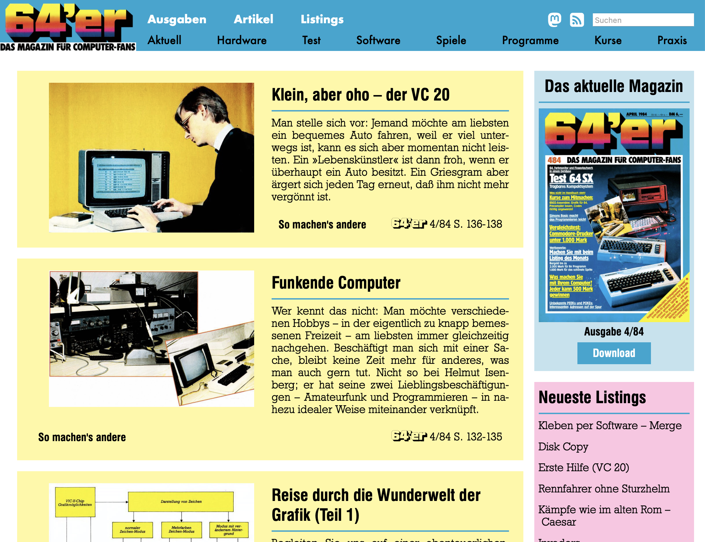
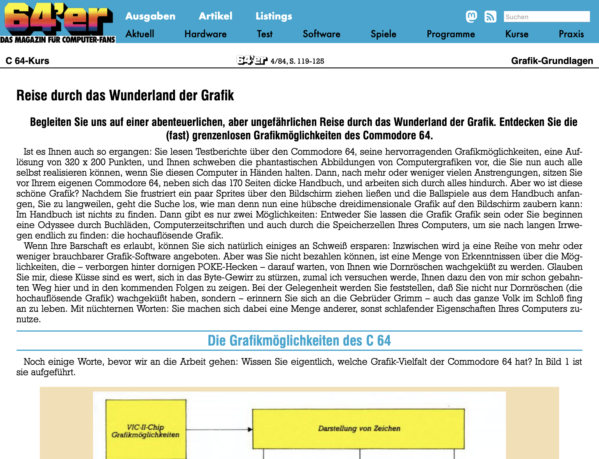

# 64er-magazin.de

Zum 40jährigen Jubiläum des *64'er Magazins* präsentieren wir das Kunstprojekt [www.64er-magazin.de](https://www.64er-magazin.de): eine Website, die so tut, als wäre 1984. Exakt 40 Jahre nach der ursprünglichen Veröffentlichung erscheint hier jeden Monat eine neue Ausgabe:

* 4/84: 20. März 2024 (Erstausgabe)
* 5/84: 19. April 2024
* 6/84: 18. Mai 2024
* usw.

Auf der modernen Homepage gibt es

* durchsuchbare PDF-Dateien der einzelnen Ausgaben
* alle Artikel im Web-Format mit Kommentar-Funktion
* alle Listings zum Download statt zum Abtippen
* Übersichtsseiten für alle Tests, alle Listings etc. über alle Ausgaben hinweg
* eine Suche über den Text aller Artikel
* einen RSS-Feed, der ab Veröffentlichung jeden Tag zwei Artikel liefert
* die Funktion, einen Artikel auf Mastodon zu teilen

Alle Artikel sind mit dem Text im gedruckten Magazin identisch, Schreibfehler und sachliche Fehler sind also unverändert. Errata aus späteren Ausgaben ("Fehlerteufelchen") werden den Artikeln allerdings angehängt, und später dokumentierte Fehler in Software sind in den Downloads bereits behoben.

## Autoren

* Michael Steil <mist64@mac.com>
* [https://github.com/ellduin](https://github.com/ellduin)

