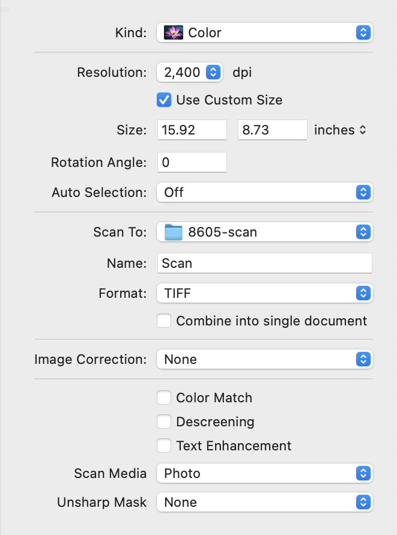
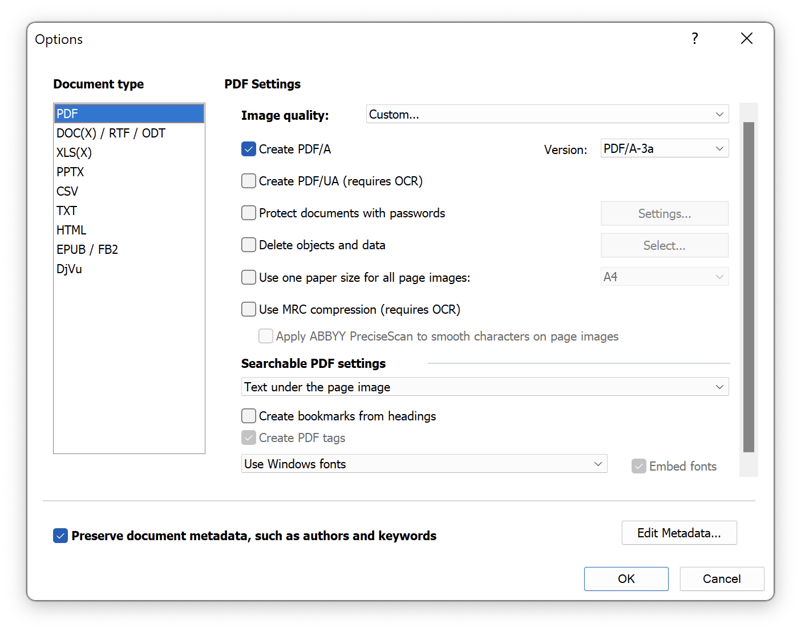
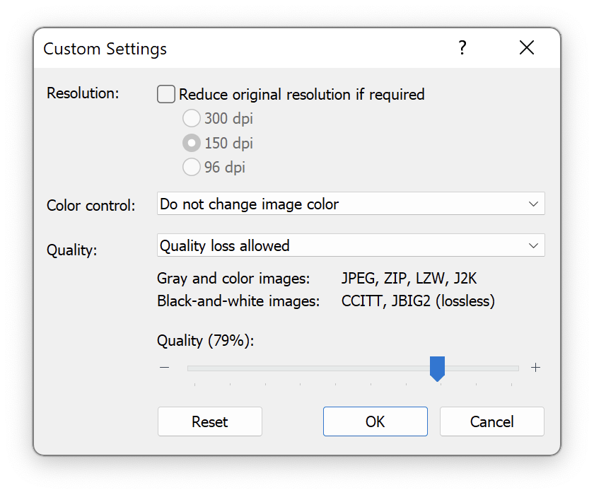

## Scanning

This is my process of scanning an issue. It'll result in about 160-180 GB of data and take 10 minues per sheet – so you should do this on the side while doing something else.

### What you Need

* An A3 flatbed scanner that can do 2400 dpi. I use a "VIISAN VF3240".
* A macOS computer (min 16 GB RAM, better 32 GB) with the built-in Image Capture app. (I tried both Windows and Linux, and both apps/drivers crash/fail when trying to scan A4 at 2400 dpi.)
* A A3 sheet of **black** construction paper.
* Another sheet of A3 construction paper (any color).

### Taking the Issue Apart

We will scan the issue sheet-by-sheet, so first remove the two (or sometimes three) clips, trying to rip the paper as little as possible.

* Open the center of the issue.
* Bend the clips up 90 degrees with e.g. a screwdriver.
* Repeatedly pull maybe 25% of the sheets through the clips.
* Finally remove the clips from the cover sheet.

### Set up the "Cage"

To make sure pages are properly aligned, we will build a vertical "cage" using construction paper. This has to be done once for each issue, because each is cut differently.

* Put the cover sheet onto the flatbad so you can read the cover.
* Align the sheet to the top right.
* Cut an A3-wide and 1 cm high strip of construction paper.
* Use sticky tape to attach the strip to the flatbed, below the cover sheet, so that there is about 1 mm between the bottom of the sheet and the strip.
* Turn the cover sheet around, so that you can read the inside of it, and put it back on the flatbed.
* If necessary, adjust the strip so there's 1 mm betwenn it and the sheet.

### Scanning the Issue

Then put the stack of sheets on a table next to the scanner, with the cover sheet up. We will be going from the outside of the issue to the inside, and doing the outside face of the sheet before the inside face.

* Take the first sheet
* Put the outside face-down into the scanner (and so the text is right-side-up from your perspective)
* Scan it (see below)
* Turn it around so the inside is face-down (and the text is still right-side-up from your perspective)
* Scan it (see below)
* Take it out and put it on a second pile, with the inside facing up.

As it is scanning, Image Capture will show "Scanning document 'Scan nnn'".

* If nnn is odd, it's the second page that is being scanned, so you will have to turn/replace the sheet after this.

**This is the biggest timesaver**: Every time you scan the *outside* of a sheet, check that the first file name is divisible by 4. You can do this by keeping a Finder window open with the target folder, and checking that the latest TIFF file is divisible by 4, minus one (e.g. 63), whenever reaching for a new sheet. If you do this consistently, you'll avoid skipping sides or scanning sides twice, which is annoying to fix later.

This will create files with the following names:

```
Scan.tiff   # first sheet, outside, left [inconsistent name, but doesn't matter]
Scan 1.tiff # first sheet, outside, right
Scan 2.tiff # first sheet, inside, left
Scan 3.tiff # first sheet, inside, right
Scan 4.tiff # second sheet, outside, left
...
```

Every now and then you should open a file and check that it contains the full page, and there is no hair on the flatbed. (In Preview, don't zoom in, this will hang the app.)

### Scanner Settings

* Create a folder on a volume that has at least 200 GB of free space.
* Start Image Capture
* Resize the window to the full height of the screen and the respective width.
* Verify the following default settings:
	* Set "Name" to "Scan"
	* Uncheck "Combine into single document"
	* Set "Rotation Angle" to 0.
	* Set "Auto Selection" to "Off"
	* Set "Image correction" to "None"
	* Uncheck "Color Match"
	* Uncheck "Descreening"
	* Uncheck "Text Enhancement"
	* Set "Unsharp Mask" to "None"
* Configure the following custom settings:
	* Set "Resolution" to "2400 dpi"
	* Set "Scan To" to the folder for your issue.
	* Set "Format" to "TIFF"
	* Set "Scan Media" to Photo
* Press "Overview"
* Draw two selection rectangles in the preview area – we don't crop the pages here, we scan a little more, and crop later
	* Both rectangles are the full width of the preview area.
	* The first rectangle starts from the very top of the preview area and goes 1 cm below the divider of the two pages.
	* The second rectangle starts from 1 cm above the divider of the two pages to the very bottom of the preview area.



Every scan operation will do the to pages separately and create two files. The reason for this is that an A3 image at 2400 dpi exceeds the maximum file size of TIFF (2 GB). (PNGs would be below 2 GB because of the compression, but the compression step after each sheet would slow down scanning.)

The VF3240 will turn itself off after 10 minutes of inactivity:
* Image Capture might now recognize it when you turn the scanner back on, so you may have to restart Image Capture.
* You will have re-do the following setup
	* Set "Scan To" to the folder for your issue (it might show the correct folder, but due to a bug in Image Capture, it may save the files in a different folder anyway unless you manually select it again)
	* Set "Scan Media" to Photo
	* the selection rectangles

### Scanning one Page

* Put the sheet (with the side you want to scan face-down) onto the flatbed
* Align it to the top right. (If the sheet is not full width, make sure the sheet's center is at the flatbed's center instead.)
* Put the black A3 sheet of construction paper on top, sliding it to the top right to make sure the sheet below is at the very top right, and doesn't go past the top, right, or the cage at the bottom.
* Close the lid and push it down a little.
* Press "Scan". This will take 10 minutes and create two TIFF files of each a little over 1 GB.

You don't need to wait for the complete process of scanning a sheet to finish before turning/replacing the sheet. You can do this as soon as the scanner has reached the end and turned off the lamp scanning the second page.

Similarly, you can already press the "Scan" button for the next sheet again before the app is finished writing the second TIFF file; just make sure you press it after the scanner's sled has started moving back, otherwise you will cancel writing the second file.

## Creating Renamed & Rotated Master PNG Files

We now have one file per page, but they are sideways, uncompressed, and not numbered correctly.

### Rotate

The following shell scripts require ImageMagick:

```
brew install imagemagick
```

Run this script in the directory containing the scanned files. It will create a subdirectory `png` with correctly rotated PNG files, but still the original numbering. This will take about 15 hours.

```
# rotate_to_png.sh
d=png
mkdir $d
for file in *.tiff; do
#for file in `ls -r1 *.tiff`; do
    output="$d/${file%.tiff}.png"
    if [ ! -f "$output" ]; then
        echo "Converting $file"
        magick "$file" -alpha off -units PixelsPerInch -density 2400 -rotate 270 "$output"
    else
        echo "Output exists, skipping $file"
    fi
done
```

### Create Thumbnails

To verify the renumbering is correct, we will first create 150 dpi thumbnails of the PNG files. Run the following script in the `png` directory files:

```
# thumbnails.sh
d=../thumbnail
mkdir $d
for file in *.png; do
    output="$d/$file"
    if [ ! -f "$output" ]; then
        echo "Converting $file"
        magick "$file" -scale 6.25% -units PixelsPerInch -density 150 "$output"
    else
        echo "Output exists, skipping $file"
    fi
done
```

### Rename

The following Python 3 script will rename the PNG files so each filename reflects the page number.

Always make a backup of the directory you work with using the "Duplicate" function in Finder (Cmd+D). This will create copy-on-write files, so it's instantaneous and does not take up additional space.

* First run the script in the `thumbnails` directory.
* Open all PNG files with Preview, and use the cursor keys to skim over it, checking that the pages are in consecutive order.
	* If there is a problem with the order, fix them in the `png` directory and create the thumbnails again.
* If everything is okay, run the script in the `png` directory.


```
# renumber.py
import os
import sys

count = len(sys.argv[1:])

if count == 0:
	print(f"Usage: {sys.argv[0]} *.png");
	exit(1)

if count % 4:
	print(f"Error: file count not divisible by 4!");
	exit(1)


src = 0
a = count
b = 1
mid = a / 2
which = 0

while True:
	if src == 0:
		src_fn = f"\"Scan.png\""
	else:
		src_fn = f"\"Scan {src}.png\""	

	if which == 0:
		system(f"mv {src_fn} {a:03d}.png")
		if a % 2 == 0:
			which = 1
		a -= 1
	else:
		system(f"mv {src_fn} {b:03d}.png")
		if b % 2 == 0:
			which = 0
		b += 1

	if a < mid + 1 or b > mid + 1:
		break

	src += 1
```

### Create a Crop File

The PNG files contain pixels that don't belong to the page on the left, the right or both, so they need to be cropped. We won't touch the PNG files any more; instead, we will create a file named `widths.txt` that contains the cropping information that can be fed into further tools.

(The file contains the width of each file (in 150 dpi units) with the part of the facing page removed. Script will use it to cut from the left or the right (depending on whether it's a left or a right page), and cut the remaining file firther to match the A4 dimensions.)

Use an image editor that lets you efficiently crop pages. In this example, I'll describe it with Affinity Photo.

Open all thumbnail (!) files (in Affinity, you need to do it in batches of <64), and for each file

* press C ("crop")
* change the rectangle to cut off **only** the side where the other page shows, **not the outside or the bottom**
* double click to confirm
* Cmd+S, Cmd+S (Close & Save)

Then, run this Python 3 script to generate `widths.txt`:

```
import os
import subprocess

with open('widths.txt', 'w') as outfile:
    # List all files in the current directory
    for filename in os.listdir('.'):
        # Check if the file is a PNG (case-insensitive)
        if filename.lower().endswith('.png'):
            # Get the filename without the extension
            name_without_ext = os.path.splitext(filename)[0]
            try:
                # Use ImageMagick's identify command to get the width
                result = subprocess.check_output(['identify', '-format', '%w', filename])
                width = result.decode('utf-8')
                # Write to widths.txt in the specified format
                outfile.write(f"{name_without_ext}: {width}\n")
            except subprocess.CalledProcessError as e:
                print(f"Error processing {filename}: {e}")
```

Finally, move `widths.txt` into the `png` directory.

You can now backup/archive/upload the `png` directory, and delete the `thumbnails` directory.

## Color Correction and Scaling

Run this script in the `png` directory to create the following versions of each page:

* 150 dpi cropped (to create the PDF)
* 150 dpi non-cropped (XXX no longer needed)
* 600 dpi non-cropped (to extract text and images for the HTML)


```
#!/bin/bash

out=../cmyk

tmp1=$(mktemp).tiff
tmp2=$(mktemp).tiff

# A4 width and height at 150 DPI
a4_width=1240
a4_height=1754

out_600=${out}/600
out_150=${out}/150
out_cropped=${out}/cropped

mkdir ${out}
mkdir ${out_600}
mkdir ${out_150}
mkdir ${out_cropped}

for in_filename in ???.png; do
	id="${in_filename%%.*}"
	
	out_filename_600="${out_600}/${id}_600.tiff"
	out_filename_150="${out_150}/${id}_150.tiff"
	out_filename_150_cropped="${out_cropped}/${id}_150_cropped.tiff"
	if [ -e "$out_filename_600" ] && [ -e "$out_filename_150" ] && [ -e "$out_filename_150_cropped" ]; then
		echo "Skipping $in_filename"
		continue
	fi

	echo ${in_filename}

	echo "    * convert to CMYK"
	# convert to CMYK
	/usr/bin/python3 ../convert.py ${in_filename} ${tmp1}
	
	# increase channel contrast
	echo "    * increase contrast"
	magick ${tmp1} \
	-colorspace CMYK \
	-channel C -level 50%,90% \
	-channel M -level 30%,70% \
	-channel Y -level 30%,70% \
	-channel K -level 90%,95% \
	+channel -colorspace CMYK \
	-density 2400 -set units PixelsPerInch \
	"${tmp2}"

	echo "    * resize to 600 dpi"
	magick "${tmp2}" \
	-resize 25% \
	-profile ../USWebCoatedSWOP.icc \
	-profile ../AdobeRGB1998.icc \
	-density 600 -set units PixelsPerInch \
	"${out_filename_600}"

	echo "    * resize to 150 dpi"
	magick "${tmp2}" \
	-resize 6.25% \
	-profile ../USWebCoatedSWOP.icc \
	-profile ../AdobeRGB1998.icc \
	-density 150 -set units PixelsPerInch \
	"${out_filename_150}"

	echo "    * get width"
	# get crop info from widths file
	crop_width=$(grep "^${id}:" widths.txt | cut -d ':' -f 2 | tr -d ' ')

	# get current width, so we can crop on the left
	width=$(magick identify -format "%w" "${out_filename_150}") 

	if [ $((10#$id % 2)) -eq 0 ]; then
		# Even page: crop starting from the calculated offset (right side), extend on the left
		crop="${crop_width}x${a4_height}+0+0"
		gravity="east"
	else
		# Odd page: crop starting from 0 (left side), extend on the right
		offset=$(($width - $crop_width))
		crop="${crop_width}x${a4_height}+${offset}+0"
		gravity="west"
	fi
	
	#echo ${in_filename} ${crop_width} ${crop} ${gravity}
	
	echo "    * crop"
	magick "${out_filename_150}" \
	-crop $crop \
	-background white \
	-gravity $gravity \
	-extent ${a4_width}x${a4_height} \
	"${out_filename_150_cropped}"

done < widths.txt
```

## Clean up the Title Page

From the color-corrected output, take make a copy of `001_150_cropped.tiff` and open it with an image editor like Affinity Photo.

* Use the "Inpainting Brush Tool" to
	* fix the four edges
	* remove scratches and dirt, especially in single-colored areas
* Use the "Blur Brush" tool to fix single-colored areas.
* Use the "Inpainting Brush Tool" again to remove transparency introduced at the edges (this is an Affinity Photo bug).

(You can change the brush size with `[` and `]`.)

Use ImageMagick to remove the alpha channel from the file:

magick 001_150_cropped_COPY.tiff -alpha off title.png

## Creating a PDF

Use ABBYY FineReader on Windows to create an OCRed PDF:

* In the settings, disable all image processing and auto-rotate.
* Load title.png
	* Make sure the "Resolution" field says 150, otherwise fix it
* Load the 150 dpi cropped files, except the first one
* Set languages to "German", "English", "Basic"
* "Recognize" all pages.
* Save as "Searchable PDF Document" with these settings:




Experiment with the "Quality" value so you get a PDF file that is just under 100 MB (104857600 bytes). (Otherwise GitHub won't accept the file.)

Use `exiftool` to set the metadata of the resulting PDF correctly, like this, but remember to update the issue number:

```
exiftool -Title="64'er 11/84" -Author="Markt & Technik" 64er_1984-11.pdf
```

## Extracting the Images

...

## OCR for HTML

Use ABBYY FineReader on Windows to extract the text for the HTML files.

* Load all 600 dpi non-cropped files.
* Set languages to "German", "English", "Basic"
* "Recognize" all pages.
* Iterate over all headings/boxes/columns (excluding tables), right click and "Copy Text", paste it into a single file using a rich text editor, save it as `.txt`.
* Iterate over all tables, right click and "Copy Text", paste it into a single file using a rich text editor, save it as `.html`

I use FineReader inside Parallels on macOS, and copy the text into macOS TextEdit.

* Format the `.txt` in MarkDown format.
* Convert the MarkDown file to `.html`.
	* Use a plaintext editor's search-and-replace function to remove all HTML styling.
* Split the HTML into one file per article, name them "<page number> <article title>".
* Add empty headers and footers to the article HTMLs.
* Copy the tables at their respective places.
* ...

...


